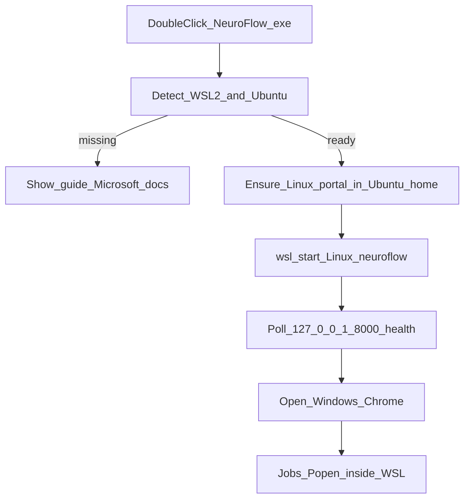

# Windows WSL launcher — master plan

This is the **information matrix** for later sub-plans. Each phase is independently implementable once the previous phase’s contract is frozen. Do not re-open the decisions below in a sub-plan unless the product goal changes.

## Locked decisions (do not revisit in sub-plans)

- **Compute stays Linux.** Do not rewrite [`neuroflow/tools/base.py`](neuroflow/tools/base.py), [`host_probe.py`](neuroflow/tools/host_probe.py), [`job_kill.py`](neuroflow/services/job_kill.py), or per-tool `Popen` to spawn `wsl.exe recon-all`. Jobs keep using allowlisted subprocesses inside Ubuntu.
- **Windows `.exe` is a launcher only.** It detects WSL, copies/starts the **Linux** portal binary inside Ubuntu, waits for health, opens the **Windows** browser at `http://127.0.0.1:8000/`.
- **Do not auto-install WSL, do not reboot, do not run `wsl --install`.** If WSL/Ubuntu is missing: explain, link [Microsoft’s install guide](https://learn.microsoft.com/windows/wsl/install), and wait for the user to come back. Optional later: a button that *opens* that page (or copies `wsl --install`). Never silent UAC/reboot.
- **Disk:** WSL does not ask the user to reserve a partition. The Ubuntu VHDX grows with use (max ceiling ~1 TB). The launcher must not pretend to size a disk. Warn that FreeSurfer/FSL later consume many GB **inside Linux**.
- **Data lives on the Linux filesystem** (`~/.neuroflow` in the Ubuntu home via existing [`neuroflow/runtime_paths.py`](neuroflow/runtime_paths.py) frozen defaults). Do not point jobs at `C:\Users\...` / `/mnt/c` as the primary store.
- **Host tools stay vendor installs** inside Ubuntu. NeuroFlow does not download FreeSurfer/FSL/SCT. The assistant only guides + rescan.
- **Default distro name: `Ubuntu`.** If another distro exists but Ubuntu does not, tell the user to install Ubuntu (or, in a later sub-plan, pick a distro). Do not silently use Debian/docker-desktop.
- **Language:** code, comments, UI copy, docs, commits remain **English** (project standard).

## Current vs target

**Today:** [`.github/workflows/release.yml`](.github/workflows/release.yml) builds a native Win32 PyInstaller app from [`neuroflow/packaged_app.py`](neuroflow/packaged_app.py) via [`packaging/build_release.ps1`](packaging/build_release.ps1). That process runs FastAPI **on Windows**. Probes and `Popen` look at the Windows PATH. README tells users to run `neuroflow.exe`; FAQ/bug template still say Windows is unsupported.

**Target zip layout (Windows):**

- `NeuroFlow.exe` — launcher (new entrypoint, not the current Win32 API server)
- `linux-payload/` — the **same** onedir Linux build produced on `ubuntu-latest` (or a nested zip)
- `README-WINDOWS.txt` — 1 page: extract, click, if blocked follow Microsoft WSL page, then install host tools in Ubuntu

Linux and macOS zips stay as they are (portal runs natively).

---

## Phase 0 — Product contract and docs alignment

**Status: complete** (2026-08-26)

**Goal:** One official story before any new `.exe` exists. Cheap, unblocks support and later PRs.

**User-facing sentence (keep everywhere):** A person clicks NeuroFlow on Windows, uses the site in Chrome, and processing happens in Linux on WSL — provided WSL and the neuroimaging tools are already installed, with a guided assistant pointing at official docs.

**Deliverables:**

- Rewrite Windows sections in [`README.md`](README.md), [`docs/user/installation.md`](docs/user/installation.md), [`docs/user/faq.md`](docs/user/faq.md), [`docs/architecture.md`](docs/architecture.md), [`docs/user/host-tools.md`](docs/user/host-tools.md).
- Change [`.github/ISSUE_TEMPLATE/bug.yml`](.github/ISSUE_TEMPLATE/bug.yml) OS option from `Windows (unsupported)` to `Windows 11 + WSL2 Ubuntu` (plus optional `Windows 10 + WSL2`).
- New user page `docs/user/windows-wsl.md` + matching in-app help `frontend/src/pages/help/windows-wsl.html` (link from [`frontend/src/pages/help/index.html`](frontend/src/pages/help/index.html)).
- Explicitly document: no auto-install; admin + possible reboot are **Microsoft’s** installer; VHDX grows, nothing is reserved; first Ubuntu launch creates a Linux username/password; jobs and datasets are **inside Ubuntu**, not under `C:\`.

**Out of scope:** code for the launcher.

**Acceptance:** A new Windows user reading only installation + FAQ understands they need WSL2 Ubuntu first, and that `neuroflow.exe` will not run FreeSurfer on native Windows.

**Later sub-plan:** “Docs: Windows is WSL launcher, not native CLI host.”

---

## Phase 1 — WSL detection gate (no start yet)

**Status: complete** (2026-08-26)

**Goal:** A testable Python module that answers: can we launch into Ubuntu?

**New package (suggested):** `neuroflow/windows_launcher/` (imported by a thin `neuroflow/windows_launcher_app.py`). Keep it unused on Linux/macOS packaged builds.

**Capabilities:**

- Find `wsl.exe`.
- Parse `wsl -l -v` (UTF-16 LE output is a common Windows gotcha — tests must cover this).
- States: `wsl_missing` | `wsl_present_no_ubuntu` | `ubuntu_stopped` | `ubuntu_running` | `ubuntu_needs_user_setup` (first-boot password not finished — detect if possible, else treat failed `wsl -d Ubuntu -- true` as this).
- For missing WSL: return the official URL `https://learn.microsoft.com/windows/wsl/install` and short English copy (admin, possible restart, no disk reservation, Linux user on first launch). **Do not** call `wsl --install`.
- CLI/dry-run: `NeuroFlow.exe --status` prints the state (useful for tests and support).

**UI for this phase:** console + optional `webbrowser.open` of the Microsoft page when the user passes `--open-wsl-docs`. A Win32 MessageBox is enough; no full GUI framework yet.

**Tests:** unit tests with mocked `subprocess` for `wsl -l -v` samples (no real WSL in CI).

**Acceptance:** On a machine without WSL, the exe exits 0 after showing the guide (or non-zero with a clear code) and **never** enables Windows features.

**Later sub-plan:** “Windows launcher: detect WSL/Ubuntu and show Microsoft install guide.”

---

## Phase 2 — Runtime: copy Linux portal into WSL and open the browser

**Goal:** Happy path for a user who **already** has Ubuntu.

**Sequence after Phase 1 says Ubuntu is ready:**

1. Resolve Linux payload next to the exe (`linux-payload/neuroflow` ELF onedir).
2. Copy into Ubuntu if missing or version-mismatched, e.g. `~/.neuroflow-app/<version>/` via `wsl -d Ubuntu --` and `wslpath` / `\\wsl$\Ubuntu\home\...`. Prefer copying **into the Linux filesystem**, not running the ELF from `/mnt/c/...`.
3. If `http://127.0.0.1:8000/api/v1/health` already succeeds: only open the browser (idempotent double-click).
4. Else start: `wsl -d Ubuntu -- ~/.neuroflow-app/<ver>/neuroflow` (the existing Linux [`packaged_app.py`](neuroflow/packaged_app.py) entry — uvicorn + frozen `~/.neuroflow` **in Linux**).
5. Poll health from **Windows** (WSL2 localhost forwarding on Windows 11; document Win10 NAT caveats).
6. `webbrowser.open("http://127.0.0.1:8000/")` on Windows (same idea as current [`packaged_app.py`](neuroflow/packaged_app.py) lines 26–30).
7. Keep a small console: “NeuroFlow is running — you can minimize this window.” Stop can wait until Phase 5.

**Do not** translate job argv paths. The Linux portal writes data under Linux `~/.neuroflow`.

**Failure copy:** Ubuntu not initialized (create Linux user first); port 8000 busy; payload missing; WSL localhost not forwarded (link troubleshooting).

**Tests:** mock `wsl`, mock HTTP health, temp dirs for copy logic.

**Acceptance:** With Ubuntu already installed and the Linux payload present, double-click opens Chrome on Windows and the Home page loads from the API inside WSL. `GET /api/v1/modules` reflects tools on the **Ubuntu** PATH, not Windows.

**Later sub-plan:** “Launcher: install Linux payload in Ubuntu, start portal, poll health, open browser.”

---

## Phase 3 — Release packaging and CI

**Goal:** The GitHub Release Windows zip **is** the launcher + Linux payload, not a Win32 FastAPI.

**Pipeline change** in [`.github/workflows/release.yml`](.github/workflows/release.yml):

1. Keep `ubuntu-latest` `packaging/build_release.sh` as the **source of truth** for the compute binary.
2. **Windows job depends on the Linux artifact** (upload-artifact / download-artifact), then:
   - build launcher via new `packaging/windows_launcher.spec` + `packaging/build_windows_launcher.ps1`;
   - nest the Linux onedir (or zip) as `linux-payload/`;
   - add `README-WINDOWS.txt`;
   - emit `neuroflow-<ver>-windows-x86_64.zip`.
3. Stop using [`packaging/build_release.ps1`](packaging/build_release.ps1) to PyInstaller-pack [`packaged_app.py`](neuroflow/packaged_app.py) as the Windows product (that script can remain for experimental native-Win32 debugging, or be deleted in the same PR to avoid two stories).
4. macOS job unchanged.
5. Document: WSL2 on ARM Windows is **out of scope** for v1 (launcher should refuse with a clear message if `wsl` reports aarch64 and payload is x86_64).

**Local maintainer path:** Linux zip built first (or CI artifact), then Windows launcher pack. `make release-build` on Linux stays Linux-only.

**Acceptance:** A release tag produces a Windows zip whose `NeuroFlow.exe` does not import uvicorn as the main process; the ELF lives under `linux-payload/`. CI does not need FSL on `windows-latest`.

**Later sub-plan:** “CI: Windows zip = launcher + Linux payload from ubuntu-latest.”

---

## Phase 4 — Guided host-tools assistant (still no vendor installers)

**Goal:** After the portal is up, a leigo who has WSL but no FreeSurfer/FSL/SCT knows what to do **in Ubuntu**, without a terminal if possible.

**Launcher (optional extra):** after health OK, run `wsl -d Ubuntu -- ~/.neuroflow-app/.../neuroflow scan` (or `neuroflow scan` CLI inside the payload) and, if packages are missing, open `/help/windows-wsl.html` or `/help/host-tools.html` instead of only Home.

**In-app (required):** extend [`docs/user/host-tools.md`](docs/user/host-tools.md) and [`frontend/src/pages/help/host-tools.html`](frontend/src/pages/help/host-tools.html) with a Windows subsection: install tools **inside Ubuntu**; then `POST /api/v1/host/rescan` (already documented). Home already shows **Install on host** — keep that; only add the WSL-specific where.

**Out of scope:** wrapping FSL/FreeSurfer installers, `apt` as root from the Windows exe.

**Acceptance:** Missing tools never look like a NeuroFlow bug on Windows PATH. Copy always says “install in Ubuntu, then rescan.”

**Later sub-plan:** “Windows help: host tools live in Ubuntu; rescan after install.”

---

## Phase 5 — Stop, polish, QA matrix

**Goal:** Supportable daily use.

- Stop: second verb `NeuroFlow.exe --stop` → `wsl -d Ubuntu --` kill the portal PID or a recorded pidfile under `~/.neuroflow-app/`. Do not `wsl --shutdown` (that kills other WSL work).
- Single-instance lock so two double-clicks do not spawn two uvicorns.
- SmartScreen note already in README; keep it.
- Manual QA (no need for FSL in CI):

  - Win11, WSL **absent**: guide + Microsoft URL, no feature enable.
  - Win11, Ubuntu **present**, tools **absent**: UI loads; modules Install on host.
  - Win11, Ubuntu + at least one CLI: Execute produces `run.log` as on Linux.
  - Second double-click: only browser.
  - `--stop` then health fails.
  - Port 8000 taken: clear error.

**Later sub-plan:** “Launcher stop/single-instance and Windows QA checklist.”

---

## Explicitly deferred (not this program)

- Native Windows `Popen` + path `.exe` + `killpg` port.
- `wsl.exe` wrapping each CLI from a Win32 API (path translation, `/mnt/c`).
- Auto `wsl --install` / auto-reboot.
- Silent FreeSurfer/FSL/SCT install.
- Docker.
- Signing/notarizing the `.exe` (can be a separate ops sub-plan).
- macOS Slicer.app layout (unrelated).

---

## Suggested order of later sub-plans

1. Docs contract (Phase 0) — can merge immediately.
2. Detection module + tests (Phase 1).
3. Start/copy/health/browser (Phase 2) — needs a locally built Linux payload to dogfood.
4. CI zip wiring (Phase 3) — after 2 works on a dev machine.
5. Host-tools copy (Phase 4) — can overlap with 0.
6. Stop + QA (Phase 5).

Phase 0 and Phase 4 docs can share one documentation PR. Phases 1–3 are the engineering spine.

## Definition of done (whole program)

A Windows 11 user: extracts the release zip → double-clicks `NeuroFlow.exe` → if WSL is missing, sees a calm English guide and the official Microsoft page → after they installed Ubuntu themselves and click again → Chrome opens NeuroFlow → with FreeSurfer/FSL/SCT installed **in Ubuntu**, Execute works and logs stream, with no Linux terminal required for daily use.
