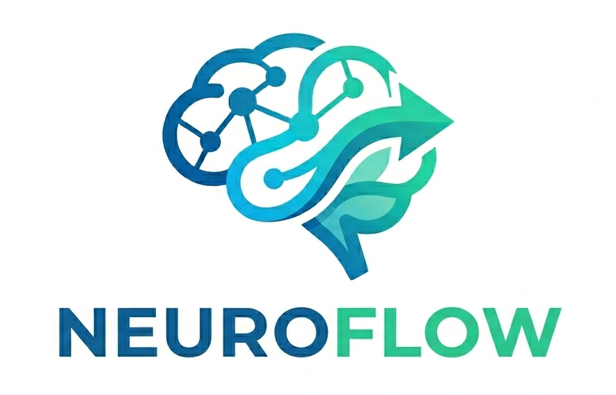

<p align="center">
  
</p>

# NeuroFlow

**Neuroimaging CLI tools, one web page at a time.**

NeuroFlow is a **facilitation portal** for neuroscience medical image processing: **one independent page per CLI** (FreeSurfer, FSL, and Spinal Cord Toolbox in the portal today). Each module provides upload, parameter forms, command preview, and **local subprocess** execution.

It is **not** a multi-tool pipeline runner and **does not** ship Docker. You install host packages yourself; NeuroFlow wraps them in a FastAPI + HTML/Tailwind UI.

[](https://github.com/acsenrafilho/neuroflow/actions/workflows/ci.yml)
[](https://github.com/acsenrafilho/neuroflow/releases/latest)
[](https://neuroflowpipelines.readthedocs.io/)
[](LICENSE)
[](https://www.python.org/downloads/)
[](https://github.com/astral-sh/ruff)
[](CODE_OF_CONDUCT.md)
[](https://github.com/sponsors/acsenrafilho)

**Stack:** Python 3.10+ · Poetry · FastAPI · HTML/Tailwind · pytest · MkDocs

**Versioning:** [Semantic Versioning](https://semver.org/) (`MAJOR.MINOR.PATCH`), starting at `0.0.1`. Merges to `main` drive releases via Conventional Commits (see [CHANGELOG.md](CHANGELOG.md)).

**Docs:** [User guide on Read the Docs](https://neuroflowpipelines.readthedocs.io/) · in-app help at `/help/` · OpenAPI at `/docs`

## End users (Windows / macOS / Linux)

Download a pre-built portal package from the **[latest GitHub Release](https://github.com/acsenrafilho/neuroflow/releases/latest)** — no Poetry or Node required.

| Platform | Asset (example) | How to run |
|----------|-----------------|------------|
| Windows | `neuroflow-*-windows-*.zip` | See [Windows and WSL](https://neuroflowpipelines.readthedocs.io/en/latest/user/windows-wsl/) — processing runs in **WSL2 Ubuntu**, not native Windows |
| macOS | `neuroflow-*-macos-*.zip` | Extract → run `./neuroflow/neuroflow` (see Gatekeeper note below) |
| Linux | `neuroflow-*-linux-*.zip` | Extract → `chmod +x neuroflow/neuroflow` → run `./neuroflow/neuroflow` |

On **Windows**, you use the site in Chrome on Windows while the portal and neuroimaging CLIs run in **Linux on WSL2 Ubuntu**. NeuroFlow does not run FreeSurfer, FSL, or SCT on native Windows. Install WSL and Ubuntu yourself ([Microsoft guide](https://learn.microsoft.com/windows/wsl/install)); NeuroFlow never auto-installs WSL. Full path: [Windows and WSL on Read the Docs](https://neuroflowpipelines.readthedocs.io/en/latest/user/windows-wsl/).

The app starts the local API, serves the UI, and opens [http://127.0.0.1:8000/](http://127.0.0.1:8000/). Job and dataset files are stored under `~/.neuroflow/` in the environment where the portal runs (Ubuntu home on Windows via WSL — not under `C:\Users\...` as the primary store).

**macOS:** if Gatekeeper blocks the binary, use **System Settings → Privacy & Security → Open Anyway**, or `xattr -dr com.apple.quarantine neuroflow` after extract.

**Windows:** SmartScreen may warn on unsigned builds — choose **More info → Run anyway** when you trust the release source.

The release zip is the **NeuroFlow portal only**. It does **not** include FreeSurfer, FSL, or SCT. On Windows, install those **inside WSL2 Ubuntu** (see [Windows and WSL](https://neuroflowpipelines.readthedocs.io/en/latest/user/windows-wsl/)). On Linux or macOS, install on the host and ensure tools are on `PATH` (or set the `NEUROFLOW_*` env vars). See [Host tools](https://neuroflowpipelines.readthedocs.io/en/latest/user/host-tools/).

## Developers (Ubuntu / Debian)

Development and from-source install stay on Linux with Poetry:

```bash
git clone https://github.com/acsenrafilho/neuroflow.git
cd neuroflow
make setup
make api
```

Open http://127.0.0.1:8000/ (with `NEUROFLOW_SERVE_FRONTEND=1` from `.env.example`). In-app user guide: http://127.0.0.1:8000/help/. User documentation: https://neuroflowpipelines.readthedocs.io/. OpenAPI (Swagger): http://127.0.0.1:8000/docs.

For a one-click start from the application menu or Desktop (Linux, Poetry install):

```bash
make desktop-install
```

Then use the **NeuroFlow** icon (background server + browser). Stop with `./scripts/neuroflow-stop.sh`.

### Prerequisites

**NeuroFlow toolchain** (Ubuntu 22.04+ / Debian 12+):

- [Poetry](https://python-poetry.org/) (Python 3.10+)
- [Node.js](https://nodejs.org/) 18+ (frontend Tailwind build)

On Debian/Ubuntu, `make setup` checks these and can suggest `apt` / Poetry installer commands.

**Host neuroimaging tools (optional)** — install on the machine yourself; NeuroFlow does not install them:

- **FreeSurfer** (`recon-all` on `PATH`, or `NEUROFLOW_RECON_ALL_BIN`)
- **FSL** (`bet`, `flirt`, etc. on `PATH`, or `NEUROFLOW_FSLDIR` / `FSLDIR`)
- **Spinal Cord Toolbox (SCT)** (`sct_version` on `PATH`, `$HOME/sct_*`, or `SCT_DIR` / `NEUROFLOW_SCT_DIR`)
- Optional (code present, hidden in the portal UI for now): ANTs, 3D Slicer, ITK

### Manual install (toolchain already present)

```bash
cp .env.example .env
make install
make frontend-build
poetry run neuroflow serve
```

Dev shortcuts: `poetry run neuroflow serve` (or `make api`) — uvicorn with reload on `127.0.0.1:8000`.

Local packaged zip (optional): `make release-build` → `dist/release/neuroflow-*-linux-*.zip`.

## Viewing the frontend

The UI is **not** served from `frontend/src/pages/`. That folder is source only. Tailwind builds CSS and copies HTML into `frontend/dist/`, which is the deployable site.

**Always build before preview:**

```bash
make frontend-build
# or: cd frontend && npm run build
```

Pages link to absolute paths such as `/assets/app.css`. The web server root must therefore be `frontend/dist/`, not the repository root and not `src/pages/`.

| Method | URL | Notes |
|--------|-----|--------|
| FastAPI + static | http://127.0.0.1:8000/ | Set `NEUROFLOW_SERVE_FRONTEND=1` in `.env`. UI and API share the same origin. |
| Python | http://127.0.0.1:8080/ | `cd frontend/dist && python -m http.server 8080` |
| Live Server (VS Code / Cursor) | http://127.0.0.1:5500/ | Uses [`.vscode/settings.json`](.vscode/settings.json) (`root`: `frontend/dist`). Install the **Live Server** extension, build the frontend, then **Go Live** from `frontend/dist/index.html` or the workspace. |

**Do not** open `http://127.0.0.1:5500/frontend/src/pages/index.html` — CSS and logo paths will 404 and the layout will look broken.

With Live Server on port 5500 and the API on port 8000, hub features that call `/api/v1/tools` require the API to be running; for a full stack preview, prefer `NEUROFLOW_SERVE_FRONTEND=1` on port 8000.

| Command | Description |
|---------|-------------|
| `make setup` | First-machine bootstrap (apt checks, deps, frontend build) |
| `make install` | Install Python and frontend dependencies |
| `make desktop-install` | Linux application menu + Desktop shortcut |
| `make test` | Run pytest |
| `make lint` | Run pre-commit hooks (ruff + file hygiene) |
| `make api` | Start FastAPI via `poetry run neuroflow serve` (reload; host package scan on startup) |
| `make frontend-build` | Build Tailwind CSS and copy pages to `frontend/dist/` |
| `make release-build` | PyInstaller onedir zip under `dist/release/` |
| `make docs` | Serve MkDocs locally (user guide + developer pages) |

## Project layout

```
neuroflow/          # Python package (api, tools, services)
frontend/           # Production UI (hub + per-tool pages)
packaging/          # Desktop entry + PyInstaller release build
doc/mockup/         # Legacy design reference mockups
doc/licenses/       # Third-party tool license notices
data/jobs/          # Job metadata and logs (gitignored contents)
data/datasets/      # BIDS-inspired workspace / subject trees
docs/               # MkDocs source
scripts/            # setup, launch, host scan helpers
tests/
```

## API

- User documentation: https://neuroflowpipelines.readthedocs.io/
- In-app user guide: http://127.0.0.1:8000/help/ (when frontend is served)
- OpenAPI: http://127.0.0.1:8000/docs
- Health: `GET /api/v1/health`
- Tools / modules: `GET /api/v1/tools`, `GET /api/v1/modules` (portal: FreeSurfer, FSL, SCT)
- Active jobs: `GET /api/v1/jobs`
- Host resources: `GET /api/v1/host/resources`
- FreeSurfer job: `POST /api/v1/tools/freesurfer/jobs` (multipart: files, `subject_ids`, `workspace`, …)
- FSL job: `POST /api/v1/tools/fsl/jobs` (multipart: files, `workspace`, `subject_id`, `module_id`, …)

## Adding a tool

See [CONTRIBUTING.md](CONTRIBUTING.md). Short path:

1. Register the tool in `neuroflow/tools/registry.py`.
2. Add argv builder + launcher under `neuroflow/tools/<name>.py`.
3. Add API routes under `neuroflow/api/v1/tools.py` (or a dedicated router).
4. Add `frontend/src/pages/tools/<name>.html` following the FreeSurfer module pattern.

## Community

NeuroFlow is a personal project. Issues and pull requests are welcome; response time may vary.

- [Open an issue](https://github.com/acsenrafilho/neuroflow/issues/new/choose) for bugs, features, or questions (use the form that matches).
- Look for [`good first issue`](https://github.com/acsenrafilho/neuroflow/issues?q=is%3Aissue+is%3Aopen+label%3A%22good+first+issue%22) and [`help wanted`](https://github.com/acsenrafilho/neuroflow/issues?q=is%3Aissue+is%3Aopen+label%3A%22help+wanted%22).
- Read [CONTRIBUTING.md](CONTRIBUTING.md) and the [Code of Conduct](CODE_OF_CONDUCT.md).
- Security reports: [SECURITY.md](SECURITY.md) (private advisory, not a public issue).

## Citation

If you use NeuroFlow in academic work, cite the software via [CITATION.cff](CITATION.cff) (GitHub **Cite this repository**).

## Sponsors

Optional [GitHub Sponsors](https://github.com/sponsors/acsenrafilho) support maintenance time. The software remains MIT-licensed either way.

## License

MIT — see [LICENSE](LICENSE). Third-party neuroimaging tools (FSL, ANTs, FreeSurfer, 3D Slicer) have separate licenses; see [doc/licenses/](doc/licenses/).
