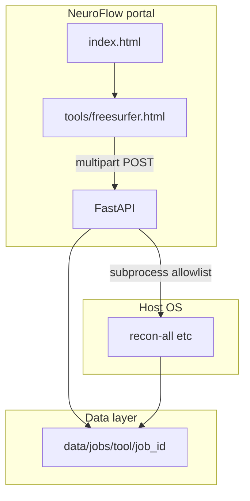

# Architecture

## Overview



## Design rules

1. **One tool per page** — no cross-tool pipeline composer or shared orchestration DAG.
2. **No heavy compute inside FastAPI** — the API starts allowlisted subprocesses and streams logs to disk.
3. **No database (MVP)** — job metadata lives in `data/jobs/<tool>/<job_id>/meta.json`.
4. **No authentication (MVP)** — local/trusted network only; see [Security](security.md).
5. **No Docker in repo** — tools must be installed on the host where the API runs.

## API surface

| Resource | Path |
|----------|------|
| Health | `GET /api/v1/health` |
| Tools | `GET /api/v1/tools` |
| FreeSurfer jobs | `POST /api/v1/tools/freesurfer/jobs` |
| Job status | `GET /api/v1/tools/freesurfer/jobs/{job_id}` |
| Job log | `GET /api/v1/tools/freesurfer/jobs/{job_id}/log` |

Errors return `{ "detail", "code", "field?" }`.

## Job layout

```
data/jobs/freesurfer/{job_id}/
  input/       # uploaded NIfTI/DICOM
  output/      # SUBJECTS_DIR for recon-all
  meta.json    # status, parameters, command
  run.log      # merged stdout/stderr
```

## Processing contract

- Executables must be on an **allowlist** (`recon-all` today).
- Arguments are built server-side from validated form fields (never raw shell strings from the browser).
- Optional `NEUROFLOW_FREESURFER_HOME` sets `FREESURFER_HOME` for child processes.
