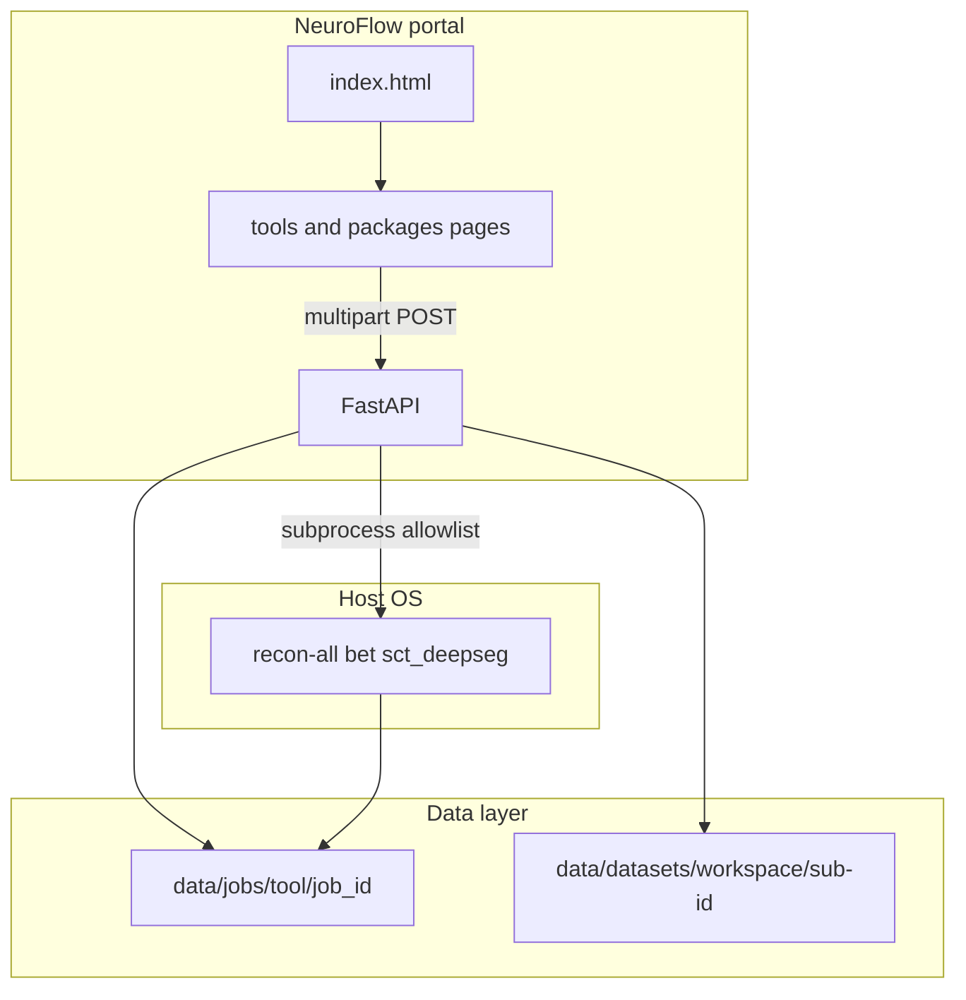

# Architecture

## Overview



## Design rules

1. **One tool per page** — no cross-tool pipeline composer or shared orchestration DAG.
2. **No heavy compute inside FastAPI** — the API starts allowlisted subprocesses and streams logs to disk.
3. **No database (MVP)** — job metadata lives in `data/jobs/<tool>/<job_id>/meta.json`.
4. **No authentication (MVP)** — local/trusted network only; see [Security](security.md).
5. **No Docker in repo** — tools must be installed on the host where the API runs.

**Packaged distribution:** GitHub Releases ship a PyInstaller build of the **portal only** (API + built UI). Host neuroimaging CLIs are never bundled. Frozen runs resolve UI assets from the bundle and write job/dataset data under `~/.neuroflow/`.

**Windows:** The Windows zip is a **thin launcher** on Windows. When Ubuntu is ready, it copies the Linux portal onedir into `~/.neuroflow-app/<version>/` inside Ubuntu, starts that ELF, polls `GET /api/v1/health` from Windows, and opens the browser at `http://127.0.0.1:8000/`. FastAPI, allowlisted `Popen`, and host probes run **inside Ubuntu** — not on native Win32. Until Phase 3 ships `linux-payload/` in the release zip, maintainers dogfood with a locally built Linux onedir (see [Development](development.md)). NeuroFlow never auto-installs WSL.

Portal-visible packages are **FreeSurfer**, **FSL**, and **SCT**. ANTs, 3D Slicer, and ITK may exist in code but are hidden from the UI.

## API surface

| Resource | Path |
|----------|------|
| Health | `GET /api/v1/health` |
| Host rescan | `POST /api/v1/host/rescan` |
| Tools | `GET /api/v1/tools` |
| Modules | `GET /api/v1/modules` |
| Jobs list | `GET /api/v1/jobs` |
| Workspaces | `GET/POST /api/v1/workspaces` |
| Per-tool jobs | `POST /api/v1/tools/{tool_id}/jobs` |
| Job status / log | `GET /api/v1/tools/{tool_id}/jobs/{job_id}` and `.../log` |

Errors return `{ "detail", "code", "field?" }`. Full contract: [API](api.md).

## Job layout

```text
data/jobs/<tool>/{job_id}/
  input/       # uploaded files
  output/      # tool working directory
  meta.json    # status, parameters, command
  run.log      # merged stdout/stderr
```

Researcher-facing trees: `data/datasets/<workspace>/sub-<id>/derivatives/<package>/…`.

## Processing contract

- Executables must be on an **allowlist** (portal CLIs such as `recon-all`, FSL binaries, and SCT commands).
- Arguments are built server-side from validated form fields (never raw shell strings from the browser).
- Optional env vars (for example `NEUROFLOW_FREESURFER_HOME`, `NEUROFLOW_FSLDIR`, `NEUROFLOW_SCT_DIR`) set the child process environment.
