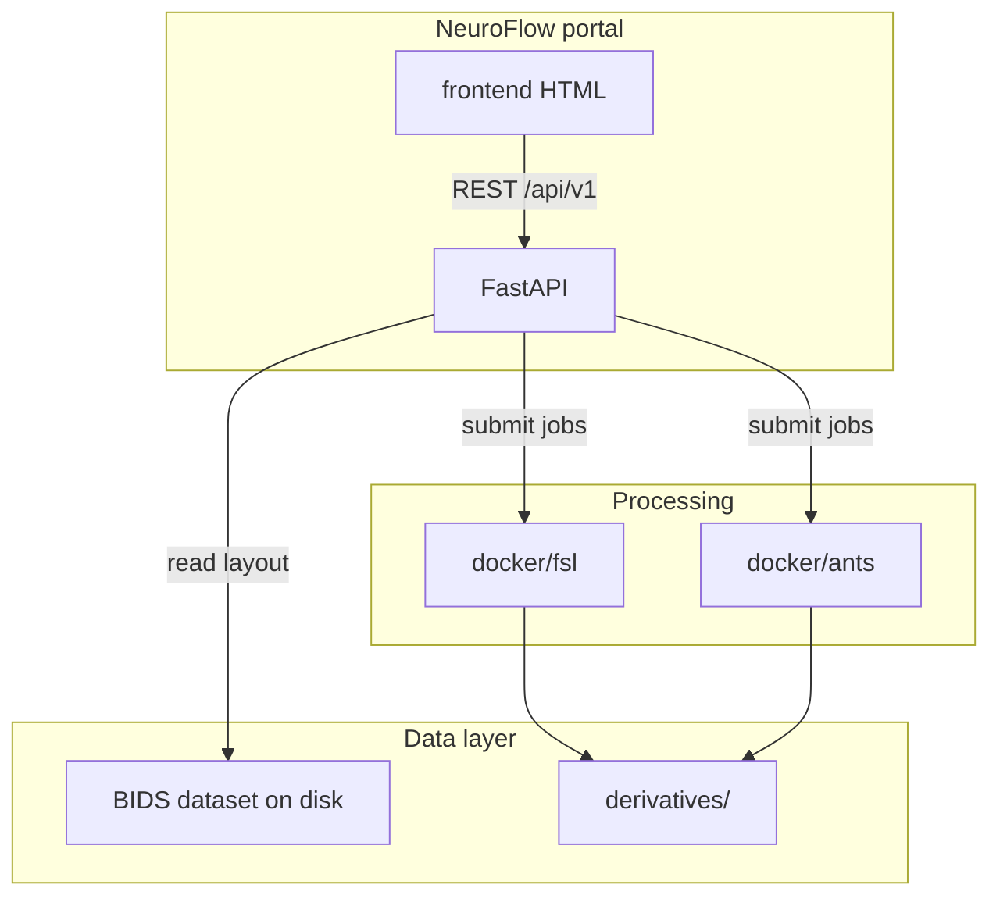

# Architecture

## Overview

## Design rules

1. **BIDS on disk** — no parallel naming scheme; portal exposes `sub-*`, `ses-*`, modalities.
2. **No heavy compute in FastAPI** — pipelines run in Docker with BIDS volumes mounted read-only.
3. **No database (MVP)** — run metadata lives under `derivatives/<pipeline>/` as JSON sidecars (future).
4. **No authentication (MVP)** — local/trusted network only; see [Security](security.md).

## API surface

| Resource | Path |
|----------|------|
| Health | `GET /api/v1/health` |
| Datasets | `GET /api/v1/datasets` |

Errors return `{ "detail", "code", "field?" }`.

## Processing contract

Containers receive:

- `BIDS_ROOT` → `/data/bids`
- `SUBJECT`, `SESSION`, `PIPELINE_CONFIG_JSON`

Logs go to stdout/stderr; exit codes are recorded by the orchestration layer (planned).
